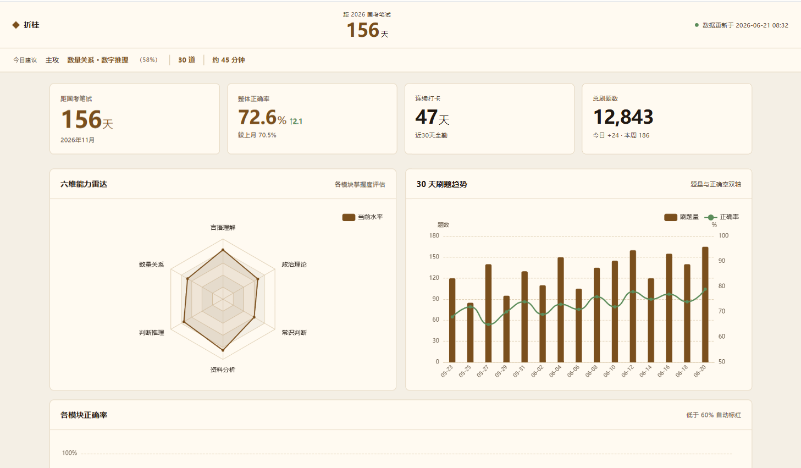
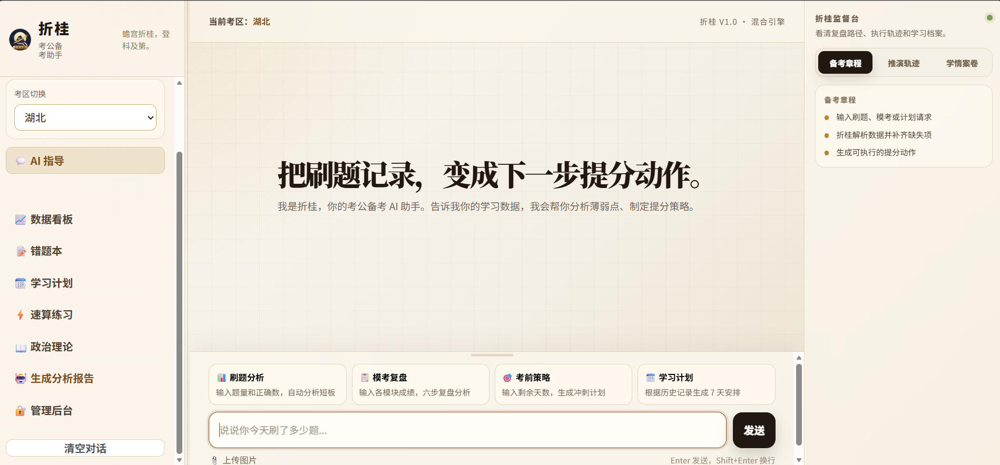

# 折桂 — 考公备考 AI 助手

省 70% Token 的混合引擎考公备考系统。




## 核心设计

市面上的 AI 备考工具：用户提问 → 模型回答。每次都要模型算正确率、查卷子结构、匹配老师——浪费 Token，结果还不稳。

折桂不这么做：**路由是代码确定的，不是模型决定的。**

```
用户输入 → 模型识别意图（仅此一步走 LLM）
         → calc MCP Server 算正确率（代码，0 Token）
         → matcher MCP Server 查错因 + 匹配老师（代码，0 Token）
         → 模型根据精准数据写报告（LLM）
```

**计算正确率、查卷子结构、匹配名师、校验数据——这些全部走本地代码。只有写报告才调模型。**

## 功能

- **刷题复盘** — 输入数据 → 代码算正确率 → 定位错因 → 推荐老师
- **模考分析** — 多模块模考 → 校验数据（拦截"20题对了30题"）→ 性价比分析 → 报告
- **考前策略** — 自动加载省份卷子结构 → 用时建议 → 策略生成
- **学习计划** — 聚合错题+模考+速算 → 7 天计划
- **图片导入** — 拍题 → MiMo 多模态提取 → 一键入错题本
- **速算练习** — 花生十三题型，计时刷题
- **政治理论** — 知识库随机刷题
- **数据看板** — 打卡热度、正确率趋势、ECharts 可视化图表

## 技术栈

**后端：** FastAPI + SSE + SQLite  
**前端：** 纯 HTML/CSS/JS + ECharts  
**AI：** DeepSeek API + MiMo 多模态  
**协议：** MCP（3 个 Server）+ 幻觉防御 + 重试降级 + Token 预算  
**监控：** LLM 调用指标（延迟/token/成功率）

## 快速开始

```bash
git clone https://github.com/wjl1441/zhegui.git
cd zhegui
cp .env.example .env
# 编辑 .env 填入你的 API Key
pip install -r requirements.txt
uvicorn server:app --reload --port 8000
```

打开 `http://127.0.0.1:8000`

## 项目结构

```
折桂/
├── hybrid_engine.py          # 混合引擎（71KB，核心大脑）
├── server.py                 # FastAPI 入口 + SSE
├── hallucination_defense.py  # 三层幻觉防御
├── model_router.py           # 模型路由
├── metrics.py                # LLM 监控
├── recovery.py               # 重试降级
├── budget.py                 # Token 预算
├── calc/matcher/validator_mcp_server.py   # 3 个 MCP Server
├── screenshots/              # 功能截图
└── frontend/                 # 前端页面
```

## 截图

折桂支持快速从刷题数据生成分析报告：

- **混合引擎流程侧栏**：每次分析都会标注哪步走了「代码节点」、哪步走了「模型节点」
- **数据看板**：指标卡 + 雷达图 + 趋势图 + 模块正确率 + 热力图
- **速算练习**：截位直除、分数比较等题型，计时刷题，每日打卡

## License

MIT
